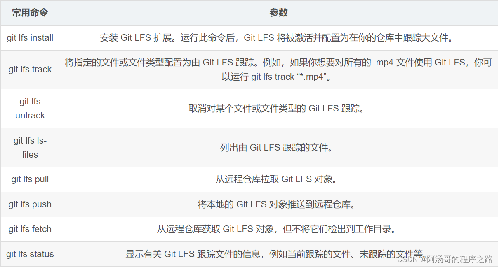

# **基于边缘计算的文档智能处理与分类系统**

针对纸质文档数字化处理需求，开发基于边缘计算的智能处理系统，通过自适应光照补偿系统、自适应**OCR**增强和轻量化文本分类技术，实现文档内容的实时解析与智能分类。

## 项目结构

**树莓派边缘计算系统**
├─ **硬件控制层**
│  ├─ JQ8900语音模块控制
│  ├─ GPIO中断事件管理
│  └─ 摄像头驱动控制
├─ **数据处理流水线**
│  ├─ 图像采集模块
│  ├─ 自适应二值化处理
│  ├─ 图像自动分页平面化处理
│  └─ OCR文本增强处理
├─ **智能决策层**
│  ├─ TextCNN文本分类模型
│  ├─ 动态词汇表管理
│  └─ 多粒度文本分割
└─ **服务接口层**
   ├─ 阿里云盘同步
   ├─ 语音交互接口
   └─ 实时日志系统

## 设计流程

### 树莓派控制摄像机

在树莓派中，开机自启动run.py文件，里面包括有对LED灯的控制，对按键的监听：按键1：控制连接在树莓派中的USB摄像头进行拍摄，将文件保存在本地，同时使用阿里云盘发送到手机上；按键2：对得到的照片进行处理，实现从摄像机输出的图片到OCR输入的图片的端到端处理。

### 端到端处理

先将原始的图片使用训练好的Unet神经网络进行图像分割：得到图像的掩码，再将掩码应用到原图片中，得到删除背景的图片。


然后将掩码应用于原图得到经过掩码处理过的图片


接着，对图像进行全自动分页处理，得到经过自动旋转和切割得到图片


然后，对图片进行自动分页处理，得到左页面和右页面


再接着，将图像进行自动化展平处理，得到经过展平后的作业面和右页面


由于展平后会导致文字倾斜，所以我们再进行文本倾斜校正


接下来，我们将自动化裁剪获取到存在文本的区域，


最后，我们将根据文本的规模，将文本区域自动切割成三块或者四块，并进行文本的显示效果增强

**左侧页面**

页面一


页面二


页面三


**右侧页面**

页面一


页面二


页面三


在得到这些小的页面文本区域块后，我们使用pytesseract库进行OCR文本识别，将文本识别的内容作为TextCNN神经网络的数据输入，当然，输入之前需要先删除文本中的停用词，因为这些停用词对神经网络的判断是有弊无利的。

最后就是通过已经训练好的TextCNN模型对文本内容进行预测，将预测得到的书籍类型作为输出，然后我们在run.py中执行JQ8900Controller中的函数，通过树莓派向JQ8900语音播报模块发送字节，选择保存在JQ8900语音播报模块中的语音文件。

至此，该项目的所有功能实现。

## 项目涉及到的第三方工具库

| Package                 | Version              |
| ----------------------- | -------------------- |
| absl-py                 | 2.1.0                |
| albucore                | 0.0.23               |
| albumentations          | 2.0.5                |
| aligo                   | 6.2.4                |
| annotated-types         | 0.7.0                |
| certifi                 | 2024.8.30            |
| charset-normalizer      | 3.3.2                |
| click                   | 8.1.8                |
| colorama                | 0.4.6                |
| coloredlogs             | 15.0.1               |
| contourpy               | 1.3.0                |
| cycler                  | 0.12.1               |
| datclass                | 0.2.28               |
| Deprecated              | 1.2.18               |
| docker-pycreds          | 0.4.0                |
| fonttools               | 4.53.1               |
| gitdb                   | 4.0.12               |
| GitPython               | 3.1.44               |
| grpcio                  | 1.70.0               |
| h5py                    | 3.12.1               |
| humanfriendly           | 10.0                 |
| humanize                | 4.12.1               |
| idna                    | 3.8                  |
| imageio                 | 2.37.0               |
| importlib_resources     | 6.5.2                |
| joblib                  | 1.4.2                |
| kiwisolver              | 1.4.6                |
| lazy_loader             | 0.4                  |
| Markdown                | 3.7                  |
| markdown-it-py          | 3.0.0                |
| MarkupSafe              | 3.0.2                |
| matplotlib              | 3.7.1                |
| mdurl                   | 0.1.2                |
| networkx                | 3.4.2                |
| nibabel                 | 5.3.2                |
| numpy                   | 1.25.0               |
| opencv-contrib-python   | 4.11.0.86            |
| opencv-python-headless  | 4.11.0.86            |
| packaging               | 24.1                 |
| pandas                  | 2.0.3                |
| pillow                  | 10.4.0               |
| pip                     | 24.2                 |
| platformdirs            | 4.3.6                |
| protobuf                | 5.29.3               |
| psutil                  | 7.0.0                |
| pydantic                | 2.10.6               |
| pydantic_core           | 2.27.2               |
| Pygments                | 2.19.1               |
| pyparsing               | 3.1.4                |
| pyreadline3             | 3.5.4                |
| pyserial                | 3.5                  |
| pytesseract             | 0.3.13               |
| python-dateutil         | 2.9.0.post0          |
| pytz                    | 2024.1               |
| PyYAML                  | 6.0.2                |
| qrcode                  | 8.0                  |
| qrcode-terminal         | 0.8                  |
| requests                | 2.32.3               |
| rich                    | 13.9.4               |
| scikit-image            | 0.25.2               |
| scikit-learn            | 1.5.1                |
| scipy                   | 1.14.1               |
| seaborn                 | 0.13.2               |
| sentry-sdk              | 2.22.0               |
| setproctitle            | 1.3.5                |
| setuptools              | 72.1.0               |
| shellingham             | 1.5.4                |
| SimpleITK               | 2.4.1                |
| simsimd                 | 6.2.1                |
| six                     | 1.16.0               |
| smmap                   | 5.0.2                |
| stringzilla             | 3.12.2               |
| tensorboard             | 2.19.0               |
| tensorboard-data-server | 0.7.2                |
| tensorboardX            | 2.6.2.2              |
| thop                    | 0.1.1.post2209072238 |
| threadpoolctl           | 3.5.0                |
| tifffile                | 2025.2.18            |
| torch                   | 1.12.0+cu116         |
| torchaudio              | 0.12.0+cu116         |
| torchio                 | 0.20.4               |
| torchvision             | 0.13.0+cu116         |
| tqdm                    | 4.66.5               |
| typer                   | 0.15.2               |
| typing_extensions       | 4.12.2               |
| tzdata                  | 2024.1               |
| urllib3                 | 2.2.2                |
| wandb                   | 0.19.8               |
| Werkzeug                | 3.1.3                |
| wheel                   | 0.43.0               |
| wrapt                   | 1.17.2               |

## 在系统开发过程中遇到的问题汇总

### 长时间没使用树莓派，在连电后无法正常连接网络

针对这个问题，我第一时间想到我给手机热点重命名过一次。

因此，目标就很明确了，将树莓派中的wpa_supplicant.conf配置（专门用来配置网络）中的ssid属性更改为当前的手机热点名称，尝试过后发现仍然不能连接上网络。

后来查找资料后了解到，在树莓派烧录系统的时候也有让填过一个网络的配置，因此我感觉树莓派的网络配置应该不止有那一个，所以为了避免产生更多的问题，我将手机热点名称更改成了原来的名称，树莓派才终于正常连接上了。

### 使用RPi.GPIO实现对LED的控制时，会产生报错“RuntimeError: Failed to add edge detection”

针对这个问题，我最开始发现它时有时无，就是有时尝试多次都会产生报错，有时尝试多次都没有产生报错，莫名其妙的。

后来经过我不断地控制变量，最终发现在root权限下启动run.py的时候，就不会产生这个报错；但在用户pi权限下启动run.py的时候，就会产生这个报错。

于是我在开机后，在自启动中将树莓派设置成root用户，因此树莓派在执行的时候就不会产生报错了。

### 每次按下按键后，有很大概率执行两次

针对这个问题，我知道是由于防抖没有做好引起的，但是我跟着网上的教程，在添加边缘检测的时候，设置了一个参数`bouncetime=200`，但是我发现这样并没有起到防抖的效果，即使我按的非常快。后面我又尝试着将数值调大一些，但是发现仍然是相同的问题。

考虑到也有可能是硬件的问题，于是我把两个按键交换了一下位置，发现仍然有这样的问题。在我走投无路的时候，突然间想到会不会是因为两个按键同时出现了问题呢？于是我把两个按键都换新了，结果发现，真的是因为两个按键同时出现了问题导致的。￣へ￣

### 没有修改函数代码的情况下，程序突然间不能执行

最开始的时候，我很奇怪为什么几乎没改变代码的情况下，突然间不能运行了，于是我开始思考问题出现的原因，难道是因为我在之前把windows系统中的文件copy到树莓派中导致的吗？我在copy之前还特地检查过了在合并时可能存在的问题，在我感觉没有问题的情况下才进行copy，那么如果不是这个问题的话，又是什么呢？我根据代码的报错，上网上搜集信息，根据报错一的内容我检查出是由于输入的数据类型存在问题，于是我将原来的

```python
x = torch.tensor(x)
y = torch.tensor(x)
```

修改成了

```python
x = torch.tensor([item[0] for item in contents], dtype=torch.long)
y = torch.tensor([item[2] for item in contents], dtype=torch.long)
```

但是接下来又产生了新的报错：报错二，我根据报错的内容“在RNN中期待的序列的长度应该比0大”，这是我开始思考为什么输入会是0呢？我想起来为了测试方便，我在使用摄像机拍照的时候，并不都是拍真实的书本，而是随便把摄像头放了个地方拍摄的，会不会是因为拍摄的内容中不包含任何文本信息导致OCR识别的内容是空呢？于是我重新拍了一张照片作为输入，发现问题居然真的解决了。

这个问题困扰了我好几个小时，但是归根结底发现是由于处理数据不规范导致的，在处理数据的时候，没有考虑到输入数据为0的情况，这也是我以后提升的方向之一。

- 报错一

```error
Traceback (most recent call last):
  File "/home/pi/dc/run.py", line 240, in button_callback2
    outputs = model(data)
  File "/usr/local/lib/python3.10/dist-packages/torch/nn/modules/module.py", line 1553, in _wrapped_call_impl
    return self._call_impl(*args, **kwargs)
  File "/usr/local/lib/python3.10/dist-packages/torch/nn/modules/module.py", line 1562, in _call_impl
    return forward_call(*args, **kwargs)
  File "/home/pi/dc/models/TextRNN.py", line 55, in forward
    out = self.embedding(x)  # [batch_size, seq_len, embeding]=[128, 32, 300]
  File "/usr/local/lib/python3.10/dist-packages/torch/nn/modules/module.py", line 1553, in _wrapped_call_impl
    return self._call_impl(*args, **kwargs)
  File "/usr/local/lib/python3.10/dist-packages/torch/nn/modules/module.py", line 1562, in _call_impl
    return forward_call(*args, **kwargs)
  File "/usr/local/lib/python3.10/dist-packages/torch/nn/modules/sparse.py", line 164, in forward
    return F.embedding(
  File "/usr/local/lib/python3.10/dist-packages/torch/nn/functional.py", line 2267, in embedding
    return torch.embedding(weight, input, padding_idx, scale_grad_by_freq, sparse)
RuntimeError: Expected tensor for argument #1 'indices' to have one of the following scalar types: Long, Int; but got torch.FloatTensor instead (while checking arguments for embedding)
```

- 报错二

```
Traceback (most recent call last):
  File "/home/pi/dc/run.py", line 240, in button_callback2
    outputs = model(data)
  File "/usr/local/lib/python3.10/dist-packages/torch/nn/modules/module.py", line 1553, in _wrapped_call_impl
    return self._call_impl(*args, **kwargs)
  File "/usr/local/lib/python3.10/dist-packages/torch/nn/modules/module.py", line 1562, in _call_impl
    return forward_call(*args, **kwargs)
  File "/home/pi/dc/models/TextRNN.py", line 56, in forward
    out, _ = self.lstm(out)  # _中包含cell和h_state
  File "/usr/local/lib/python3.10/dist-packages/torch/nn/modules/module.py", line 1553, in _wrapped_call_impl
    return self._call_impl(*args, **kwargs)
  File "/usr/local/lib/python3.10/dist-packages/torch/nn/modules/module.py", line 1562, in _call_impl
    return forward_call(*args, **kwargs)
  File "/usr/local/lib/python3.10/dist-packages/torch/nn/modules/rnn.py", line 917, in forward
    result = _VF.lstm(input, hx, self._flat_weights, self.bias, self.num_layers,
RuntimeError: Expected sequence length to be larger than 0 in RNN
```

### 在实现语音功能的时候，执行的顺序发生了错位

已知内部有五个文件，00001.mp3，00002.mp3，00003.mp3，00004.mp3，00005.mp3，当想要播放00001.mp3时播放的是00005.mp3，当想要播放00002.mp3时播放的是00001.mp3，当想要播放00003.mp3时播放的是00002.mp3，当想要播放00004.mp3时播放的是00004.mp3，当想要播放00005.mp3时播放的是00003.mp3。

这是个很奇怪的问题，似乎对应关系之间存在什么不明显的错位。但是在经过一些可能的对应关系的分析后，仍然没有找到任何规律。于是我尝试给文件重命名，但是很可惜，重命名之后仍然存在这样的错位关系。

这就很难解释了，既然更改了文件名后仍然存在相同的错位关系，那就证明实际上这些标号和文件名就没有任何关系，那到底和什么有关呢？于是我上网查找资料，终于让我找到了可能的问题原因：**模块的文件索引基于操作系统返回的物理存储顺序（也就是FAT表记录顺序），而非文件名顺序**，看到这个解释后就豁然开朗了。于是我格式化了JQ8900-16P模块的磁盘，按照我想要的顺序依次添加进磁盘，最终问题得以解决。

### 在实现图片的与处理功能的时候，使用cv2.warpPerspective函数变换后图像全黑

在对图像进行透视变换的时候，我本来采用如下的代码进行变换，但是在变换的时候，除了第一次进入循环的图片的变换是正常的，其余每次进入到循环中的图像都是全黑的，于是我开始对代码进行检查。首先，对cell_region进行可视化，发现cell_region是正常的；接着对matrix，也就是变换矩阵进行检查，我将使用原始点和目标点进行计算的变换矩阵应用在了原始点的身上，发现得到的目标点也确实是目标点，那么问题也不是在变换矩阵身上，于是我有点不知道是什么原因了。

```java
warped = cv2.warpPerspective(cell_region, matrix, (int(target_width), int(target_height)), flags=warp_method)
```

然后我开始尝试调整里面的cv2.warpPerspective()函数里面的参数，当我调整到borderMode的时候，我突然想到是不是由于调整得到的图像越界造成的呢？我将borderMode参数设置成BORDER_WARP，也就是当越界的时候使用原有的内容进行填充。

```java
warped = cv2.warpPerspective(cell_region, matrix, (int(target_width), int(target_height)), flags=warp_method, borderMode=cv2.BORDER_WRAP)
```

发现调整后得到的warped终于不再是全黑的，并且能够显示图像了。那问题就出在当发生变换的时候，变换得到的图像产生了越界，导致调用warpPerspective()函数的时候使用默认的填充方法：cv2.BORDER_DEFAULT，也就是全黑填充，从而导致图像全黑，但是产生越界的原因至今仍没有找到。

### 在使用`git`命令上传模型文件的时候，一直显示报错`couldn't connect to server`

在我上传模型文件之前，还没有遇到这个报错，遇到这个报错之后我又尝试了上传其他文件试试，发现可以正常上传没有问题，于是我开始思考是不是因为文件太大了导致的，我上网查阅github的官方文档发现了这样一句话：


就是说github会阻止大于100MB的文件，我一看我的权重参数文件，大小是118MB，那就可以解释的通了，于是我上网搜索了如何在github中上传大文件，看到需要使用`git-lfs`来实现，具体的使用方法如下所示：



